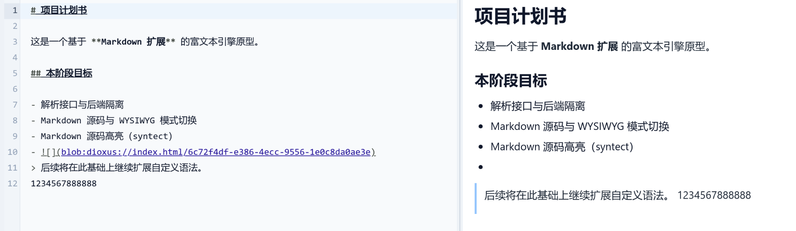

# Infinite Editor Markdown 全功能测试文档

> 这是一份用于检查 Markdown 编辑、所见即所得预览、分页与导出的综合测试文档。
> 它覆盖常用 Markdown、GFM 表格与任务列表、数学公式以及化学式。

## 1. 标题层级

### 三级标题

#### 四级标题

##### 五级标题

###### 六级标题

普通段落支持中文、English\*\*\*\*\*\*\*\*\*\*\*\*\*\*\*\*\*\*\*\*\*\*\*\*\*\*\*\*\*\*、数\*\*字 \*\*01\*\*23\*\*45\*\*6789 与标点符号。


这一行使用两个空格产生硬换行；同一段中的下一行用于检查软换行。

---

## 2. 行内样式

这里有 **粗体**、*斜体*、***粗斜体***、~~删除线~~、~~**组合样式**~~ 与 `inline_code()`。

转义字符：\*不是斜体\*，实体字符：&copy; &amp; &lt; &gt;。快捷链接：<https://dioxuslabs.com/>，邮箱：<test@example.com>。

[普通链接](https://commonmark.org/ "CommonMark")、[引用式链接][markdown-guide]，以及带说明文字的图片：


*图 1：Infinite Editor 示例文档中的图片、替代文本与资源加载。*

[markdown-guide]: https://www.markdownguide.org/ "Markdown Guide"

## 3. 引用与嵌套

> 一级引用包含 **强调文本** 和行内公式 $a^2+b^2=c^2$。
>
> > 二级嵌套引用。
>
> 1. 引用中的有序列表
> 2. 第二项

## 4. 列表与任务

- 无序列表第一项
- 第二项包含嵌套内容
  - 子项目 A
  - 子项目 B
- 第三项包含多个段落

  这是同一列表项中的第二个段落。

1. 有序列表第一项
2. 第二项
   1. 嵌套编号 2.1
   2. 嵌套编号 2.2
3. 第三项

- [x] 已完成：标题与段落
- [x] 已完成：公式与化学式
- [ ] 待检查：分页和导出

## 5. GFM 表格

| 功能 | 语法示例 | 对齐 | 状态 |
| :--- | :---: | ---: | :---: |
| 粗体 | `**text**` | 左/中/右 | ✅ |
| 行内公式 | `$E=mc^2$` | 右对齐 | ✅ |
| 化学式 | `\ce{H2O}` | 居中 | ✅ |
| 转义竖线 | `a \| b` | 右对齐 | ✅ |

## 6. 代码

行内代码中的 Markdown 标记不会生效：`**not bold**`。

```rust
#[component]
fn Counter() -> Element {
    let mut count = use_signal(|| 0);
    rsx! {
        button { onclick: move |_| *count.write() += 1, "计数：{count}" }
    }
}
```

```json
{
  "name": "infinite-editor",
  "features": ["markdown", "math", "chemistry"]
}
```

    这是缩进代码块。
    Markdown 标记 **不会** 在这里渲染。

## 7. 数学公式

行内公式：质能方程 $E=mc^2$，欧拉恒等式 $e^{i\pi}+1=0$，分数 $\frac{1}{n}\sum_{i=1}^{n}x_i$。

二次方程求根公式：

$$
x=\frac{-b\pm\sqrt{b^2-4ac}}{2a}
$$

带上下标、积分、极限和矩阵的综合公式：

$$
\lim_{n\to\infty}\left(1+\frac{1}{n}\right)^n=e,
\qquad
\int_{-\infty}^{\infty}e^{-x^2}\,dx=\sqrt{\pi}
$$

$$
\mathbf{A}=
\begin{bmatrix}
1 & 2 & 3 \\
4 & 5 & 6 \\
7 & 8 & 9
\end{bmatrix}
$$

分段函数：

$$
f(x)=
\begin{cases}
x^2, & x\ge 0 \\
-x, & x<0
\end{cases}
$$

## 8. 化学式与化学反应

行内化学式：水 $\ce{H2O}$、硫酸 $\ce{H2SO4}$、硫酸根 $\ce{SO4^2-}$、铵根 $\ce{NH4+}$。

配平反应、状态与反应条件：

$$
\ce{2H2(g) + O2(g) -> 2H2O(l)}
$$

$$
\ce{N2(g) + 3H2(g) <=>[高温、高压][催化剂] 2NH3(g)}
$$

离子反应与沉淀：

$$
\ce{Ag+(aq) + Cl-(aq) -> AgCl(s) v}
$$

有机化学简式：

$$
\ce{CH3COOH + C2H5OH <=> CH3COOC2H5 + H2O}
$$

## 9. 分隔线与特殊测试

下面是第二种分隔线写法：

***

连续空格不会被当作多个普通空格；反斜杠转义符号：\# \[ \] \( \) \{ \}。

<!-- infinite-editor:page-break -->

## 10. 显式分页后的内容

如果分页功能正常，本节应从新页面开始。最后用一段较长文字检查自动换行、跨页排版、光标编辑与导出结果：Infinite Editor 应在 Markdown 源码和所见即所得模式之间保持内容一致，并正确处理中文、西文、公式、表格、列表和代码块等不同类型的文档节点。

文档测试结束。


## 11. 超长表格自动分页

以下为一个连续的 120 行表格，检查跨页后的行号连续性，以及修改列宽、纸张尺寸后的重新分页。

| 行号 | 项目 | 验收内容 |
| ---: | --- | --- |
| 001 | 跨页测试项目 1 | 保留第 1 行的完整内容，支持 **强调**、中文与 English，分页后行号连续。 |
| 002 | 跨页测试项目 2 | 保留第 2 行的完整内容，支持 **强调**、中文与 English，分页后行号连续。 |
| 003 | 跨页测试项目 3 | 保留第 3 行的完整内容，支持 **强调**、中文与 English，分页后行号连续。 |
| 004 | 跨页测试项目 4 | 保留第 4 行的完整内容，支持 **强调**、中文与 English，分页后行号连续。 |
| 005 | 跨页测试项目 5 | 保留第 5 行的完整内容，支持 **强调**、中文与 English，分页后行号连续。 |
| 006 | 跨页测试项目 6 | 保留第 6 行的完整内容，支持 **强调**、中文与 English，分页后行号连续。 |
| 007 | 跨页测试项目 7 | 保留第 7 行的完整内容，支持 **强调**、中文与 English，分页后行号连续。 |
| 008 | 跨页测试项目 8 | 保留第 8 行的完整内容，支持 **强调**、中文与 English，分页后行号连续。 |
| 009 | 跨页测试项目 9 | 保留第 9 行的完整内容，支持 **强调**、中文与 English，分页后行号连续。 |
| 010 | 跨页测试项目 10 | 保留第 10 行的完整内容，支持 **强调**、中文与 English，分页后行号连续。 |
| 011 | 跨页测试项目 11 | 保留第 11 行的完整内容，支持 **强调**、中文与 English，分页后行号连续。 |
| 012 | 跨页测试项目 12 | 保留第 12 行的完整内容，支持 **强调**、中文与 English，分页后行号连续。 |
| 013 | 跨页测试项目 13 | 保留第 13 行的完整内容，支持 **强调**、中文与 English，分页后行号连续。 |
| 014 | 跨页测试项目 14 | 保留第 14 行的完整内容，支持 **强调**、中文与 English，分页后行号连续。 |
| 015 | 跨页测试项目 15 | 保留第 15 行的完整内容，支持 **强调**、中文与 English，分页后行号连续。 |
| 016 | 跨页测试项目 16 | 保留第 16 行的完整内容，支持 **强调**、中文与 English，分页后行号连续。 |
| 017 | 跨页测试项目 17 | 保留第 17 行的完整内容，支持 **强调**、中文与 English，分页后行号连续。 |
| 018 | 跨页测试项目 18 | 保留第 18 行的完整内容，支持 **强调**、中文与 English，分页后行号连续。 |
| 019 | 跨页测试项目 19 | 保留第 19 行的完整内容，支持 **强调**、中文与 English，分页后行号连续。 |
| 020 | 跨页测试项目 20 | 保留第 20 行的完整内容，支持 **强调**、中文与 English，分页后行号连续。 |
| 021 | 跨页测试项目 21 | 保留第 21 行的完整内容，支持 **强调**、中文与 English，分页后行号连续。 |
| 022 | 跨页测试项目 22 | 保留第 22 行的完整内容，支持 **强调**、中文与 English，分页后行号连续。 |
| 023 | 跨页测试项目 23 | 保留第 23 行的完整内容，支持 **强调**、中文与 English，分页后行号连续。 |
| 024 | 跨页测试项目 24 | 保留第 24 行的完整内容，支持 **强调**、中文与 English，分页后行号连续。 |
| 025 | 跨页测试项目 25 | 保留第 25 行的完整内容，支持 **强调**、中文与 English，分页后行号连续。 |
| 026 | 跨页测试项目 26 | 保留第 26 行的完整内容，支持 **强调**、中文与 English，分页后行号连续。 |
| 027 | 跨页测试项目 27 | 保留第 27 行的完整内容，支持 **强调**、中文与 English，分页后行号连续。 |
| 028 | 跨页测试项目 28 | 保留第 28 行的完整内容，支持 **强调**、中文与 English，分页后行号连续。 |
| 029 | 跨页测试项目 29 | 保留第 29 行的完整内容，支持 **强调**、中文与 English，分页后行号连续。 |
| 030 | 跨页测试项目 30 | 保留第 30 行的完整内容，支持 **强调**、中文与 English，分页后行号连续。 |
| 031 | 跨页测试项目 31 | 保留第 31 行的完整内容，支持 **强调**、中文与 English，分页后行号连续。 |
| 032 | 跨页测试项目 32 | 保留第 32 行的完整内容，支持 **强调**、中文与 English，分页后行号连续。 |
| 033 | 跨页测试项目 33 | 保留第 33 行的完整内容，支持 **强调**、中文与 English，分页后行号连续。 |
| 034 | 跨页测试项目 34 | 保留第 34 行的完整内容，支持 **强调**、中文与 English，分页后行号连续。 |
| 035 | 跨页测试项目 35 | 保留第 35 行的完整内容，支持 **强调**、中文与 English，分页后行号连续。 |
| 036 | 跨页测试项目 36 | 保留第 36 行的完整内容，支持 **强调**、中文与 English，分页后行号连续。 |
| 037 | 跨页测试项目 37 | 保留第 37 行的完整内容，支持 **强调**、中文与 English，分页后行号连续。 |
| 038 | 跨页测试项目 38 | 保留第 38 行的完整内容，支持 **强调**、中文与 English，分页后行号连续。 |
| 039 | 跨页测试项目 39 | 保留第 39 行的完整内容，支持 **强调**、中文与 English，分页后行号连续。 |
| 040 | 跨页测试项目 40 | 保留第 40 行的完整内容，支持 **强调**、中文与 English，分页后行号连续。 |
| 041 | 跨页测试项目 41 | 保留第 41 行的完整内容，支持 **强调**、中文与 English，分页后行号连续。 |
| 042 | 跨页测试项目 42 | 保留第 42 行的完整内容，支持 **强调**、中文与 English，分页后行号连续。 |
| 043 | 跨页测试项目 43 | 保留第 43 行的完整内容，支持 **强调**、中文与 English，分页后行号连续。 |
| 044 | 跨页测试项目 44 | 保留第 44 行的完整内容，支持 **强调**、中文与 English，分页后行号连续。 |
| 045 | 跨页测试项目 45 | 保留第 45 行的完整内容，支持 **强调**、中文与 English，分页后行号连续。 |
| 046 | 跨页测试项目 46 | 保留第 46 行的完整内容，支持 **强调**、中文与 English，分页后行号连续。 |
| 047 | 跨页测试项目 47 | 保留第 47 行的完整内容，支持 **强调**、中文与 English，分页后行号连续。 |
| 048 | 跨页测试项目 48 | 保留第 48 行的完整内容，支持 **强调**、中文与 English，分页后行号连续。 |
| 049 | 跨页测试项目 49 | 保留第 49 行的完整内容，支持 **强调**、中文与 English，分页后行号连续。 |
| 050 | 跨页测试项目 50 | 保留第 50 行的完整内容，支持 **强调**、中文与 English，分页后行号连续。 |
| 051 | 跨页测试项目 51 | 保留第 51 行的完整内容，支持 **强调**、中文与 English，分页后行号连续。 |
| 052 | 跨页测试项目 52 | 保留第 52 行的完整内容，支持 **强调**、中文与 English，分页后行号连续。 |
| 053 | 跨页测试项目 53 | 保留第 53 行的完整内容，支持 **强调**、中文与 English，分页后行号连续。 |
| 054 | 跨页测试项目 54 | 保留第 54 行的完整内容，支持 **强调**、中文与 English，分页后行号连续。 |
| 055 | 跨页测试项目 55 | 保留第 55 行的完整内容，支持 **强调**、中文与 English，分页后行号连续。 |
| 056 | 跨页测试项目 56 | 保留第 56 行的完整内容，支持 **强调**、中文与 English，分页后行号连续。 |
| 057 | 跨页测试项目 57 | 保留第 57 行的完整内容，支持 **强调**、中文与 English，分页后行号连续。 |
| 058 | 跨页测试项目 58 | 保留第 58 行的完整内容，支持 **强调**、中文与 English，分页后行号连续。 |
| 059 | 跨页测试项目 59 | 保留第 59 行的完整内容，支持 **强调**、中文与 English，分页后行号连续。 |
| 060 | 跨页测试项目 60 | 保留第 60 行的完整内容，支持 **强调**、中文与 English，分页后行号连续。 |
| 061 | 跨页测试项目 61 | 保留第 61 行的完整内容，支持 **强调**、中文与 English，分页后行号连续。 |
| 062 | 跨页测试项目 62 | 保留第 62 行的完整内容，支持 **强调**、中文与 English，分页后行号连续。 |
| 063 | 跨页测试项目 63 | 保留第 63 行的完整内容，支持 **强调**、中文与 English，分页后行号连续。 |
| 064 | 跨页测试项目 64 | 保留第 64 行的完整内容，支持 **强调**、中文与 English，分页后行号连续。 |
| 065 | 跨页测试项目 65 | 保留第 65 行的完整内容，支持 **强调**、中文与 English，分页后行号连续。 |
| 066 | 跨页测试项目 66 | 保留第 66 行的完整内容，支持 **强调**、中文与 English，分页后行号连续。 |
| 067 | 跨页测试项目 67 | 保留第 67 行的完整内容，支持 **强调**、中文与 English，分页后行号连续。 |
| 068 | 跨页测试项目 68 | 保留第 68 行的完整内容，支持 **强调**、中文与 English，分页后行号连续。 |
| 069 | 跨页测试项目 69 | 保留第 69 行的完整内容，支持 **强调**、中文与 English，分页后行号连续。 |
| 070 | 跨页测试项目 70 | 保留第 70 行的完整内容，支持 **强调**、中文与 English，分页后行号连续。 |
| 071 | 跨页测试项目 71 | 保留第 71 行的完整内容，支持 **强调**、中文与 English，分页后行号连续。 |
| 072 | 跨页测试项目 72 | 保留第 72 行的完整内容，支持 **强调**、中文与 English，分页后行号连续。 |
| 073 | 跨页测试项目 73 | 保留第 73 行的完整内容，支持 **强调**、中文与 English，分页后行号连续。 |
| 074 | 跨页测试项目 74 | 保留第 74 行的完整内容，支持 **强调**、中文与 English，分页后行号连续。 |
| 075 | 跨页测试项目 75 | 保留第 75 行的完整内容，支持 **强调**、中文与 English，分页后行号连续。 |
| 076 | 跨页测试项目 76 | 保留第 76 行的完整内容，支持 **强调**、中文与 English，分页后行号连续。 |
| 077 | 跨页测试项目 77 | 保留第 77 行的完整内容，支持 **强调**、中文与 English，分页后行号连续。 |
| 078 | 跨页测试项目 78 | 保留第 78 行的完整内容，支持 **强调**、中文与 English，分页后行号连续。 |
| 079 | 跨页测试项目 79 | 保留第 79 行的完整内容，支持 **强调**、中文与 English，分页后行号连续。 |
| 080 | 跨页测试项目 80 | 保留第 80 行的完整内容，支持 **强调**、中文与 English，分页后行号连续。 |
| 081 | 跨页测试项目 81 | 保留第 81 行的完整内容，支持 **强调**、中文与 English，分页后行号连续。 |
| 082 | 跨页测试项目 82 | 保留第 82 行的完整内容，支持 **强调**、中文与 English，分页后行号连续。 |
| 083 | 跨页测试项目 83 | 保留第 83 行的完整内容，支持 **强调**、中文与 English，分页后行号连续。 |
| 084 | 跨页测试项目 84 | 保留第 84 行的完整内容，支持 **强调**、中文与 English，分页后行号连续。 |
| 085 | 跨页测试项目 85 | 保留第 85 行的完整内容，支持 **强调**、中文与 English，分页后行号连续。 |
| 086 | 跨页测试项目 86 | 保留第 86 行的完整内容，支持 **强调**、中文与 English，分页后行号连续。 |
| 087 | 跨页测试项目 87 | 保留第 87 行的完整内容，支持 **强调**、中文与 English，分页后行号连续。 |
| 088 | 跨页测试项目 88 | 保留第 88 行的完整内容，支持 **强调**、中文与 English，分页后行号连续。 |
| 089 | 跨页测试项目 89 | 保留第 89 行的完整内容，支持 **强调**、中文与 English，分页后行号连续。 |
| 090 | 跨页测试项目 90 | 保留第 90 行的完整内容，支持 **强调**、中文与 English，分页后行号连续。 |
| 091 | 跨页测试项目 91 | 保留第 91 行的完整内容，支持 **强调**、中文与 English，分页后行号连续。 |
| 092 | 跨页测试项目 92 | 保留第 92 行的完整内容，支持 **强调**、中文与 English，分页后行号连续。 |
| 093 | 跨页测试项目 93 | 保留第 93 行的完整内容，支持 **强调**、中文与 English，分页后行号连续。 |
| 094 | 跨页测试项目 94 | 保留第 94 行的完整内容，支持 **强调**、中文与 English，分页后行号连续。 |
| 095 | 跨页测试项目 95 | 保留第 95 行的完整内容，支持 **强调**、中文与 English，分页后行号连续。 |
| 096 | 跨页测试项目 96 | 保留第 96 行的完整内容，支持 **强调**、中文与 English，分页后行号连续。 |
| 097 | 跨页测试项目 97 | 保留第 97 行的完整内容，支持 **强调**、中文与 English，分页后行号连续。 |
| 098 | 跨页测试项目 98 | 保留第 98 行的完整内容，支持 **强调**、中文与 English，分页后行号连续。 |
| 099 | 跨页测试项目 99 | 保留第 99 行的完整内容，支持 **强调**、中文与 English，分页后行号连续。 |
| 100 | 跨页测试项目 100 | 保留第 100 行的完整内容，支持 **强调**、中文与 English，分页后行号连续。 |
| 101 | 跨页测试项目 101 | 保留第 101 行的完整内容，支持 **强调**、中文与 English，分页后行号连续。 |
| 102 | 跨页测试项目 102 | 保留第 102 行的完整内容，支持 **强调**、中文与 English，分页后行号连续。 |
| 103 | 跨页测试项目 103 | 保留第 103 行的完整内容，支持 **强调**、中文与 English，分页后行号连续。 |
| 104 | 跨页测试项目 104 | 保留第 104 行的完整内容，支持 **强调**、中文与 English，分页后行号连续。 |
| 105 | 跨页测试项目 105 | 保留第 105 行的完整内容，支持 **强调**、中文与 English，分页后行号连续。 |
| 106 | 跨页测试项目 106 | 保留第 106 行的完整内容，支持 **强调**、中文与 English，分页后行号连续。 |
| 107 | 跨页测试项目 107 | 保留第 107 行的完整内容，支持 **强调**、中文与 English，分页后行号连续。 |
| 108 | 跨页测试项目 108 | 保留第 108 行的完整内容，支持 **强调**、中文与 English，分页后行号连续。 |
| 109 | 跨页测试项目 109 | 保留第 109 行的完整内容，支持 **强调**、中文与 English，分页后行号连续。 |
| 110 | 跨页测试项目 110 | 保留第 110 行的完整内容，支持 **强调**、中文与 English，分页后行号连续。 |
| 111 | 跨页测试项目 111 | 保留第 111 行的完整内容，支持 **强调**、中文与 English，分页后行号连续。 |
| 112 | 跨页测试项目 112 | 保留第 112 行的完整内容，支持 **强调**、中文与 English，分页后行号连续。 |
| 113 | 跨页测试项目 113 | 保留第 113 行的完整内容，支持 **强调**、中文与 English，分页后行号连续。 |
| 114 | 跨页测试项目 114 | 保留第 114 行的完整内容，支持 **强调**、中文与 English，分页后行号连续。 |
| 115 | 跨页测试项目 115 | 保留第 115 行的完整内容，支持 **强调**、中文与 English，分页后行号连续。 |
| 116 | 跨页测试项目 116 | 保留第 116 行的完整内容，支持 **强调**、中文与 English，分页后行号连续。 |
| 117 | 跨页测试项目 117 | 保留第 117 行的完整内容，支持 **强调**、中文与 English，分页后行号连续。 |
| 118 | 跨页测试项目 118 | 保留第 118 行的完整内容，支持 **强调**、中文与 English，分页后行号连续。 |
| 119 | 跨页测试项目 119 | 保留第 119 行的完整内容，支持 **强调**、中文与 English，分页后行号连续。 |
| 120 | 跨页测试项目 120 | 保留第 120 行的完整内容，支持 **强调**、中文与 English，分页后行号连续。 |
